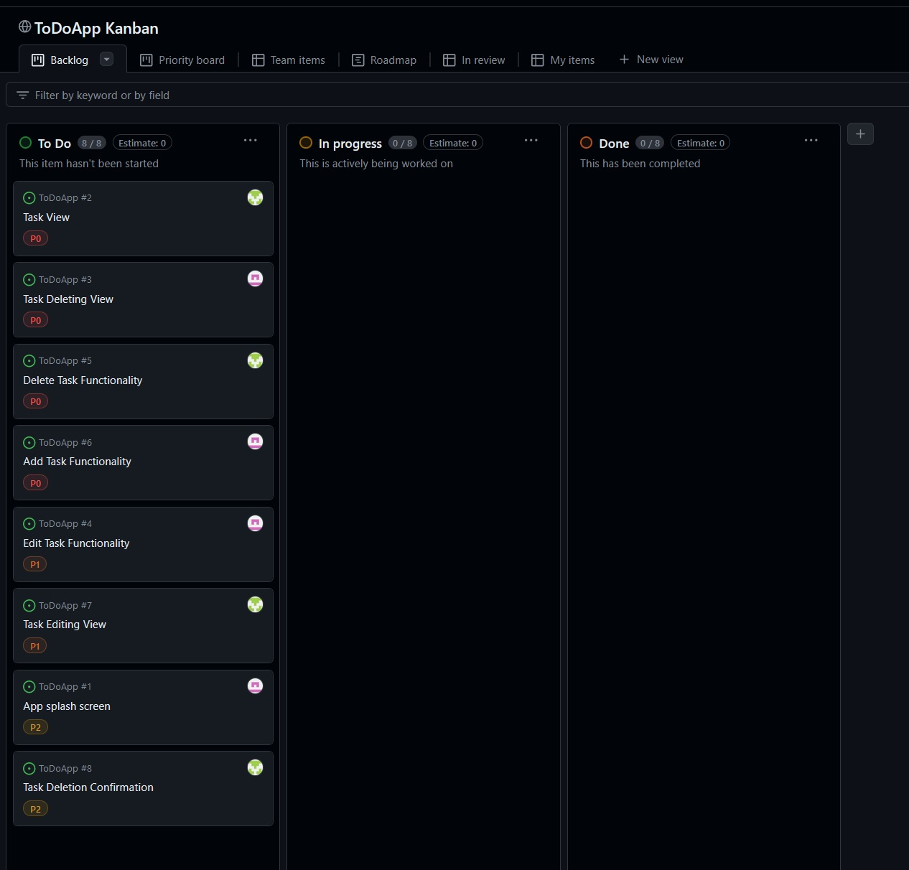

Authors: Szymon Kuczyński s22466, Michał Kalinowski s22464

Simple ToDoApp project functionality list:

Adding tasks

Updating tasks

Deleting tasks

Storing tasks in the SQLite Database

Marking tasks as "done"

Splash screen

Tasks view

View of deleting tasks

Task editing view

Issue tracker view: 

